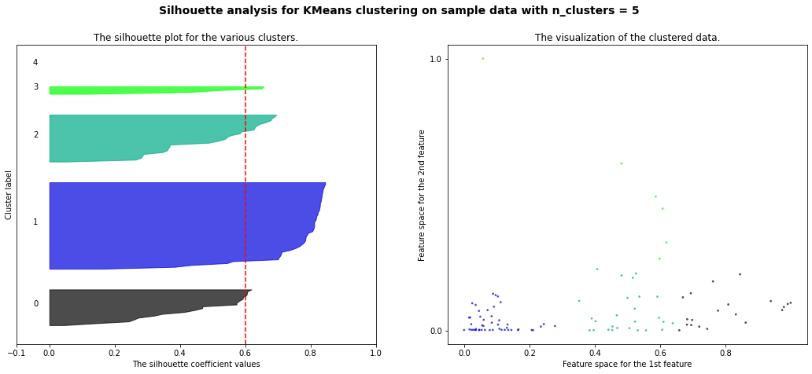
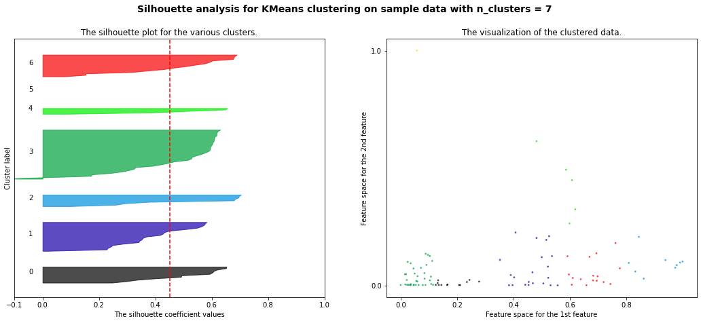
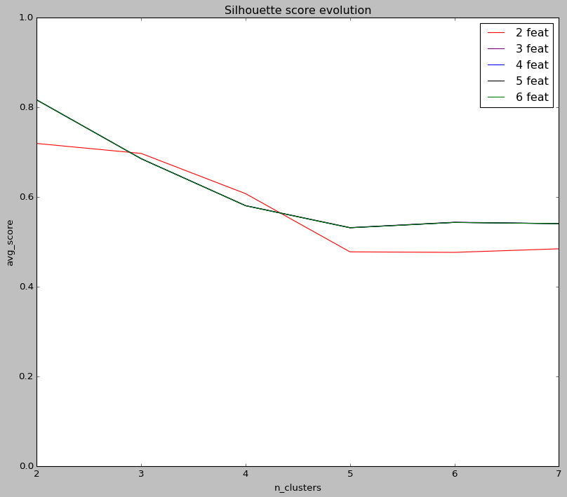
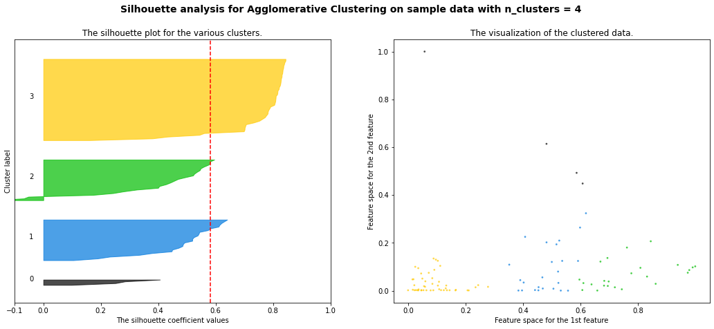

# Challenge Bearing Clustering

## Description

After the bearing analysis where faulty bearings were predicted in the [classification challenge](https://github.com/Roldan87/challenge-classification.git), this challenge aims to cluster what type of failures occur. Or rather, if the failures exhibit similarities to other failures.

## Installation

#### Python version

* Python 3.9

#### The Data

* The [dataset](https://www.kaggle.com/isaienkov/bearing-classification?select=bearing_signals.csv) is available from the kaggle website.

#### Packages

* Numpy
* Pandas
* Matplotlib
* Seaborn
* Sklearn

## Usage

| File    | Description             |
|---------|-------------------------|
| main.py | 1. Read DataFrame from csv file 2. Feature Engineering 3. Write New DataFrame to csv file |
| feature.py | Feature engineering functions |
| model.py| Clustering models implementation ([sklearn.cluster](https://scikit-learn.org/stable/modules/classes.html#module-sklearn.cluster)) |
| assets | Folder containing plots and visuals |

## Visuals

### KMeans Clustering Model

"Silhouette coefficients (as these values are referred to as) near +1 indicate that the sample is far away from the neighboring clusters. A value of 0 indicates that the sample is on or very close to the decision boundary between two neighboring clusters and negative values indicate that those samples might have been assigned to the wrong cluster.
Also from the thickness of the silhouette plot the cluster size can be visualized."

### Feature Extraction
#### 99 rows × 27 columns
['a1_x_mean', 'a1_y_mean', 'a1_z_mean', 'a2_x_mean', 'a2_y_mean', 'a2_z_mean', 'rpm_mean', 'hz_mean', 'w_mean', 'a1_x_fft_mean', 'a1_y_fft_mean', 'a1_z_fft_mean', 'a2_x_fft_mean', 'a2_y_fft_mean', 'a2_z_fft_mean', 'a1_x_amp_mean', 'a1_y_amp_mean', 'a1_z_amp_mean', 'a2_x_amp_mean', 'a2_y_amp_mean', 'a2_z_amp_mean', 'a1_x_amp_max', 'a1_y_amp_max', 'a1_z_amp_max', 'a2_x_amp_max', 'a2_y_amp_max', 'a2_z_amp_max']

#### Clustering 2 Features: (a2_x_mean & a1_x_amp_max)
#### Max Score = 0.84
The highest silhouette score for 2 clusters, yet the outliers influence this score.
From 3 clusters on, the score drops drastically.

| Features and Clusters   | Scores                                               |
|-------------------------|------------------------------------------------------|
| a2_x_mean and a1_x_amp_max |  silhouette_avg                                      |
| For n_clusters = 2      | The average silhouette_score is : 0.8391173340407827 |
| For n_clusters = 3      | The average silhouette_score is : 0.5896726770101689 |
| For n_clusters = 4      | The average silhouette_score is : 0.5876122410530076 |
| For n_clusters = 5      | The average silhouette_score is : 0.576145435502854 |
| For n_clusters = 6      | The average silhouette_score is : 0.41661611434422896 |
| For n_clusters = 7      | The average silhouette_score is : 0.4488787240769407 |

#### Clustering 2 Features: (a2_x_mean and a2_x_amp_max)
#### Max Score = 0.72
This 2 features show the 2nd highest score and best avg score as the cluster number increases.

| Features and Clusters   | Scores                                               |
|-------------------------|------------------------------------------------------|
| a2_x_mean and a2_x_amp_max |  silhouette_avg                                      |
| For n_clusters = 2      | The average silhouette_score is : 0.7193140808576391 |
| For n_clusters = 3      | The average silhouette_score is : 0.6971062066523174 |
| For n_clusters = 4      | The average silhouette_score is : 0.6074239715611994 |
| For n_clusters = 5      | The average silhouette_score is : 0.4776556949633035 |
| For n_clusters = 6      | The average silhouette_score is : 0.47652959722799404 |
| For n_clusters = 7      | The average silhouette_score is : 0.48445280262214047 |

#### Clustering 3 Features: 
#### Max Score = 0.82

| Features and Clusters                 | Scores                                               |
|---------------------------------------|------------------------------------------------------|
| a2_x_mean and a2_x_amp_max and a1_x_amp_max| silhouette_avg                                       |
| For n_clusters = 2                    | The average silhouette_score is : 0.8163113329891316 |
| For n_clusters = 3                    | The average silhouette_score is : 0.6851989189166398 |
| For n_clusters = 4                    | The average silhouette_score is : 0.5808657143340374 |
| For n_clusters = 5                    | The average silhouette_score is : 0.531830292537537 |
| For n_clusters = 6                    | The average silhouette_score is : 0.543810333392949 |
| For n_clusters = 7                    | The average silhouette_score is : 0.5407103307516351  |

#### Clustering 4 Features: 
#### Max Score = 0.81

| Features and Clusters                 | Scores                                               |
|---------------------------------------|------------------------------------------------------|
| a2_x_mean and a2_x_amp_max and a1_x_amp_max and a1_x_amp_mean | silhouette_avg                                       |
| For n_clusters = 2                    | The average silhouette_score is : 0.816337835091993 |
| For n_clusters = 3                    | The average silhouette_score is : 0.6853379489566155 |
| For n_clusters = 4                    | The average silhouette_score is : 0.5805487854437156 |
| For n_clusters = 5                    | The average silhouette_score is : 0.5313973456051717 |
| For n_clusters = 6                    | The average silhouette_score is : 0.54325716644592 |
| For n_clusters = 7                    | The average silhouette_score is : 0.5405620139117403 |

#### Clustering 5 Features: 
#### Max Score = 0.81

| Features and Clusters                 | Scores                                               |
|---------------------------------------|------------------------------------------------------|
| a2_x_mean and a2_x_amp_max and a1_x_amp_max and a1_x_amp_mean and a2_z_mean | silhouette_avg                                       |
| For n_clusters = 2                    | The average silhouette_score is : 0.8163377384185057 |
| For n_clusters = 3                    | The average silhouette_score is : 0.6853377312247558 |
| For n_clusters = 4                    | The average silhouette_score is : 0.5805483797544999 |
| For n_clusters = 5                    | The average silhouette_score is : 0.5313966795123813 |
| For n_clusters = 6                    | The average silhouette_score is : 0.5432564578049024 |
| For n_clusters = 7                    | The average silhouette_score is : 0.5405613087010945

#### Clustering 6 Features 
#### Max Score = 0.81

| Features and Clusters                 | Scores                                               |
|---------------------------------------|------------------------------------------------------|
| a2_x_mean and a2_x_amp_max and a1_x_amp_max and a1_x_amp_mean and a2_z_mean and a2_z_amp_max | silhouette_avg                                       |
| For n_clusters = 2                    | The average silhouette_score is : 0.8163377384185057 |
| For n_clusters = 3                    | The average silhouette_score is : 0.6853377312247558 |
| For n_clusters = 4                    | The average silhouette_score is : 0.5805483797544999 |
| For n_clusters = 5                    | The average silhouette_score is : 0.5313966795123813 |
| For n_clusters = 6                    | The average silhouette_score is : 0.5432564578049024 |
| For n_clusters = 7                    | The average silhouette_score is : 0.5405613087010945 |

#### Silhouette Score Evolution
The silhouette score differs from 2 features (red line) compared to 3/4/5 or 6 features (lines overlapped). After 3 features the addition of features doesn't affect the scores.

## Model Comparison

### Agglomerative Clustering Model: 
#### Max Score = 0.88
This score for n_clusters = 2 is influenced due to one outlier. For 3 to 7 clusters the score as well as the clustering is similar to the KMeans model.
#### Features: a2_x_mean and a2_x_amp_max

For n_clusters = 2 The average silhouette_score is : 0.8817317199450385 
For n_clusters = 3 The average silhouette_score is : 0.637286509478433 
For n_clusters = 4 The average silhouette_score is : 0.5964118984493065 
For n_clusters = 5 The average silhouette_score is : 0.3881427768321534 
For n_clusters = 6 The average silhouette_score is : 0.38698240565343117 
For n_clusters = 7 The average silhouette_score is : 0.42267524009350654

### MeanShift Clustering Model
#### Max Score = 0.50
#### Features: a2_x_mean and a2_x_amp_max

For n_clusters = 2 The average silhouette_score is : 0.5023390400726975 

### Spactral Clustering Model
#### Max Score = 0.11
#### Features: a2_x_mean and a2_x_amp_max

For n_clusters = 2 The average silhouette_score is : 0.11083940200971502 
For n_clusters = 3 The average silhouette_score is : 0.05755723390032442 
For n_clusters = 4 The average silhouette_score is : -0.1506008603176886 
For n_clusters = 5 The average silhouette_score is : -0.03327685423983772 
For n_clusters = 6 The average silhouette_score is : -0.16893632557173605 
For n_clusters = 7 The average silhouette_score is : -0.4212891907366274

## Conclusion

##### The features proved to be the best for clustering after all combinations were:

* *a2_x_mean*: Mean Value of sensor 2 readings in X-axis
* *a2_x_amp_max*: Maximum Amplitude of sensor 2 readings in X-axis
* *a1_x_amp_max*: Maximum Amplitude of sensor 1 readings in X-axis

##### Sklearn Model used for clustering challenge:

* *KMeans*
* Highest Silhouette Score (2 features / 2 clusters) = 0.84
* 2nd highest Sil. Score (2 features / 2 clusters) = 0.72
* Avg Sil. Avg Score (2 features / 2-7 clusters) = 0.57
* Best Sil. Avg Score (3-6 features / 2-7 clusters) = 0.61

##### Other Clustering models tried:

* *Agglomerative Clustering*      --> max Score = 0.88
* *MeanShift*                     --> max Score = 0.50
* *Spactral Clustering*           --> max Score = 0.11

