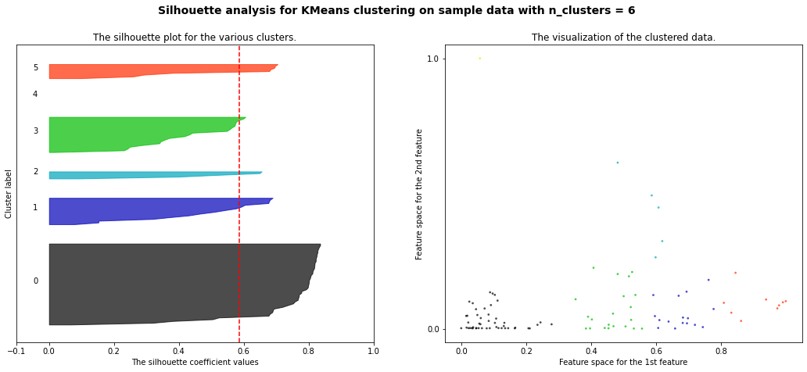

# Challenge Bearing Clustering

## Description

After the bearing analysis where faulty bearings were predicted in the [classification challenge](https://github.com/Roldan87/challenge-classification.git), this challenge aims to cluster what type of failures occur. Or rather, if the failures exhibit similarities to other failures.

## Installation

#### Python version

* Python 3.9

#### The Data

* The [dataset](https://www.kaggle.com/isaienkov/bearing-classification?select=bearing_signals.csv) is available from the kaggle website.

#### Packages

* Numpy
* Pandas
* Matplotlib
* Seaborn
* Sklearn

## Usage

| File    | Description             |
|---------|-------------------------|
| main.py | 1. Read DataFrame from csv file 2. Feature Engineering 3. Write New DataFrame to csv file |
| feature.py | Feature engineering functions |
| model.py| Clustering models implementation ([sklearn.cluster](https://scikit-learn.org/stable/modules/classes.html#module-sklearn.cluster)) |
| assets | Folder containing plots and visuals |

## Visuals

### KMeans Clustering Model

"Silhouette coefficients (as these values are referred to as) near +1 indicate that the sample is far away from the neighboring clusters. A value of 0 indicates that the sample is on or very close to the decision boundary between two neighboring clusters and negative values indicate that those samples might have been assigned to the wrong cluster.
Also from the thickness of the silhouette plot the cluster size can be visualized."

#### 2 Features

| Features and Clusters   | Scores                                               |
|-------------------------|------------------------------------------------------|
| a2_x_mean and a2_z_mean |  silhouette_avg                                      |
| For n_clusters = 2      | The average silhouette_score is : 0.6188612435218437 |
| For n_clusters = 3      | The average silhouette_score is : 0.5772479495190245 |
| For n_clusters = 4      | The average silhouette_score is : 0.5539730201832986 |
| For n_clusters = 5      | The average silhouette_score is : 0.5366576669984205 |
| For n_clusters = 6      | The average silhouette_score is : 0.5250367500156636 |
| For n_clusters = 7      | The average silhouette_score is : 0.5146061178425838 |

#### 3 Features

| Features and Clusters                 | Scores                                               |
|---------------------------------------|------------------------------------------------------|
| a2_x_mean and a2_z_mean and a2_y_mean | silhouette_avg                                       |
| For n_clusters = 2                    | The average silhouette_score is : 0.6185202303993942 |
| For n_clusters = 3                    | The average silhouette_score is : 0.5765327496751518 |
| For n_clusters = 4                    | The average silhouette_score is : 0.5528574390662281 |
| For n_clusters = 5                    | The average silhouette_score is : 0.5369145266984755 |
| For n_clusters = 6                    | The average silhouette_score is : 0.5238678602174942 |
| For n_clusters = 7                    | The average silhouette_score is : 0.512377013008427  |

#### 4 Features

| Features and Clusters                 | Scores                                               |
|---------------------------------------|------------------------------------------------------|
| a2_x_mean and a2_z_mean and a2_y_mean and a2_x_fft_mean | silhouette_avg                                       |
| For n_clusters = 2                    | The average silhouette_score is : 0.6164868634004139 |
| For n_clusters = 3                    | The average silhouette_score is : 0.5733619037988797 |
| For n_clusters = 4                    | The average silhouette_score is : 0.5463003083101764 |
| For n_clusters = 5                    | The average silhouette_score is : 0.5293495499541816 |
| For n_clusters = 6                    | The average silhouette_score is : 0.5159713210246866 |
| For n_clusters = 7                    | The average silhouette_score is : 0.4997217930780929 |

#### 5 Features

| Features and Clusters                 | Scores                                               |
|---------------------------------------|------------------------------------------------------|
| a2_x_mean and a2_z_mean and a2_y_mean and a2_x_fft_mean and a2_x_amp_mean| silhouette_avg                                       |
| For n_clusters = 2                    | The average silhouette_score is : 0.6146942490498364 |
| For n_clusters = 3                    | The average silhouette_score is : 0.5707324453883413 |
| For n_clusters = 4                    | The average silhouette_score is : 0.5413648009702641 |
| For n_clusters = 5                    | The average silhouette_score is : 0.5243917278414285 |
| For n_clusters = 6                    | The average silhouette_score is : 0.5101974928706712 |
| For n_clusters = 7                    | The average silhouette_score is : 0.4918545925328513 |

#### 6 Features

| Features and Clusters                 | Scores                                               |
|---------------------------------------|------------------------------------------------------|
| a2_x_mean and a2_z_mean and a2_y_mean and a2_x_fft_mean and a2_z_fft_mean and a2_x_amp_mean| silhouette_avg                                       |
| For n_clusters = 2                    | The average silhouette_score is : 0.6129248901207173 |
| For n_clusters = 3                    | The average silhouette_score is : 0.5687977113121171 |
| For n_clusters = 4                    | The average silhouette_score is : 0.5365745185042812 |
| For n_clusters = 5                    | The average silhouette_score is : 0.5190340658704269 |
| For n_clusters = 6                    | The average silhouette_score is : 0.5047063681260266 |
| For n_clusters = 7                    | The average silhouette_score is : 0.48516446358873805 |

#### Silhouette Score Evolution

### Agglomerative Clustering Model

Features:  a2_x_mean and a2_y_mean 
For n_clusters = 2 The average silhouette_score is : 0.6052813580401204 
For n_clusters = 3 The average silhouette_score is : 0.5619701533559098 
For n_clusters = 4 The average silhouette_score is : 0.5198946530090034 
For n_clusters = 5 The average silhouette_score is : 0.5219365474776361 
For n_clusters = 6 The average silhouette_score is : 0.5155835523099813 
For n_clusters = 7 The average silhouette_score is : 0.4904267147704647

### MeanShift Clustering Model

Features:  a2_x_mean and a2_z_mean 
For n_clusters = 2 The average silhouette_score is : 0.4788317775775801 

