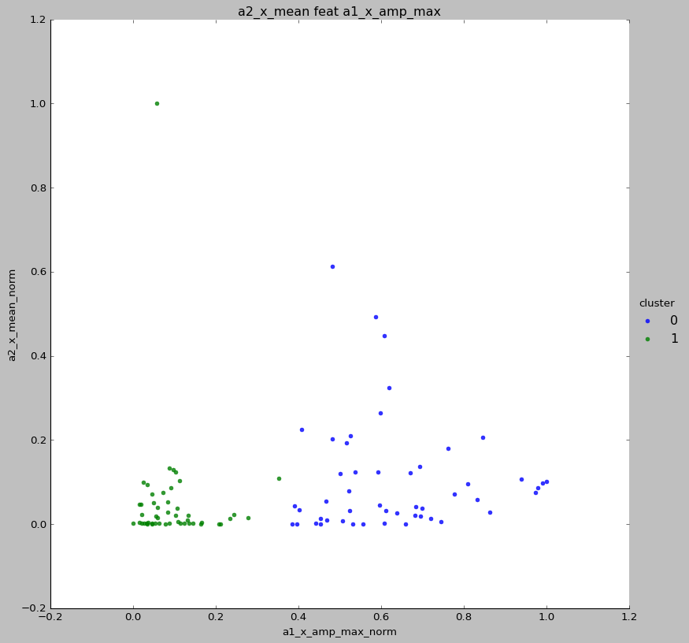
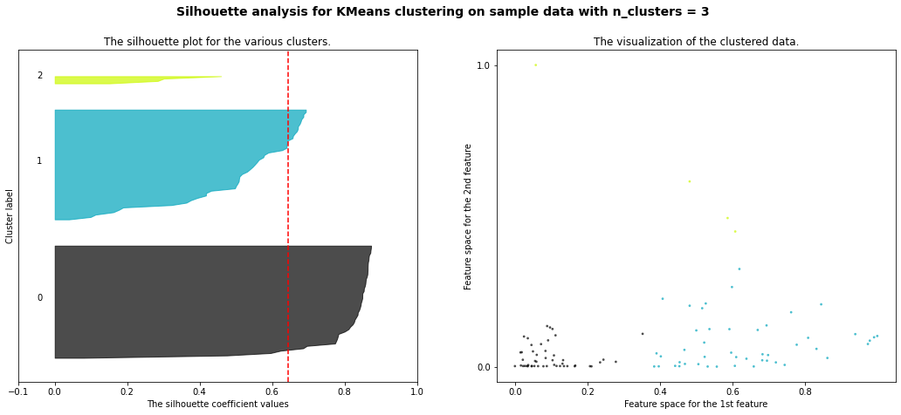

# Challenge Bearing Clustering

## Description

After the bearing analysis where faulty bearings were predicted in the [classification challenge](https://github.com/Roldan87/challenge-classification.git), this challenge aims to cluster what type of failures occur. Or rather, if the failures exhibit similarities to other failures.

## Installation

#### Python version

* Python 3.9

#### The Data

* The [dataset](https://www.kaggle.com/isaienkov/bearing-classification?select=bearing_signals.csv) is available from the kaggle website.

#### Packages

* Numpy
* Pandas
* Matplotlib
* Seaborn
* Sklearn
* Itertools

## Usage

| File    | Description             |
|---------|-------------------------|
| main.py | 1. Read DataFrame from csv file 2. Feature Engineering 3. Write new DataFrame to csv file |
| feature.py | Feature engineering functions |
| model.py| Clustering models implementation ([sklearn.cluster](https://scikit-learn.org/stable/modules/classes.html#module-sklearn.cluster)) |
| assets | Folder containing plots |

## Bearing Dataframe Features
### Feature Extraction
After feature engineering, this is the final set of features to fit the models.
##### 99 rows × 27 columns
['a1_x_mean', 'a1_y_mean', 'a1_z_mean', 'a2_x_mean', 'a2_y_mean', 'a2_z_mean', 'rpm_mean', 'hz_mean', 'w_mean', 'a1_x_fft_mean', 'a1_y_fft_mean', 'a1_z_fft_mean', 'a2_x_fft_mean', 'a2_y_fft_mean', 'a2_z_fft_mean', 'a1_x_amp_mean', 'a1_y_amp_mean', 'a1_z_amp_mean', 'a2_x_amp_mean', 'a2_y_amp_mean', 'a2_z_amp_mean', 'a1_x_amp_max', 'a1_y_amp_max', 'a1_z_amp_max', 'a2_x_amp_max', 'a2_y_amp_max', 'a2_z_amp_max']

## Visuals

### KMeans Clustering Model
#### sklearn.metrics.silhouette_score

"Silhouette coefficients (as these values are referred to as) near +1 indicate that the sample is far away from the neighboring clusters. A value of 0 indicates that the sample is on or very close to the decision boundary between two neighboring clusters and negative values indicate that those samples might have been assigned to the wrong cluster.
Also from the thickness of the silhouette plot the cluster size can be visualized."

#### Clustering 2 Features: (a2_x_mean & a1_x_amp_max)
#### Max Score = 0.64
The highest silhouette score for 2 clusters, yet the outliers influence this score.
From 3 clusters on, the score drops drastically.

| Features and Clusters   | Scores                                               |
|-------------------------|------------------------------------------------------|
| a2_x_mean and a1_x_amp_max |  silhouette_avg                                      |
| For n_clusters = 2      | The average silhouette_score is : 0.6300868277980403 |
| For n_clusters = 3      | The average silhouette_score is : 0.6437173078196544 |
| For n_clusters = 4      | The average silhouette_score is : 0.5939285786276813 |
| For n_clusters = 5      | The average silhouette_score is : 0.601409064582976 |
| For n_clusters = 6      | The average silhouette_score is : 0.5861415589173682 |
| For n_clusters = 7      | The average silhouette_score is : 0.4519906387081733 |

#### Clustering 3 Features: 
#### Max Score = 0.81

| Features and Clusters                 | Scores                                               |
|---------------------------------------|------------------------------------------------------|
| a2_x_mean and a2_x_amp_max and a1_x_amp_max| silhouette_avg                                       |
| For n_clusters = 2                    | The average silhouette_score is : 0.8163113329891316 |
| For n_clusters = 3                    | The average silhouette_score is : 0.6851989189166398 |
| For n_clusters = 4                    | The average silhouette_score is : 0.5808657143340374 |
| For n_clusters = 5                    | The average silhouette_score is : 0.531830292537537 |
| For n_clusters = 6                    | The average silhouette_score is : 0.543810333392949 |
| For n_clusters = 7                    | The average silhouette_score is : 0.5407103307516351  |

#### Clustering 4 Features: 
#### Max Score = 0.81

| Features and Clusters                 | Scores                                               |
|---------------------------------------|------------------------------------------------------|
| a2_x_mean and a2_x_amp_max and a1_x_amp_max and a1_x_amp_mean | silhouette_avg                                       |
| For n_clusters = 2                    | The average silhouette_score is : 0.816337835091993 |
| For n_clusters = 3                    | The average silhouette_score is : 0.6853379489566155 |
| For n_clusters = 4                    | The average silhouette_score is : 0.5805487854437156 |
| For n_clusters = 5                    | The average silhouette_score is : 0.5313973456051717 |
| For n_clusters = 6                    | The average silhouette_score is : 0.54325716644592 |
| For n_clusters = 7                    | The average silhouette_score is : 0.5405620139117403 |

#### Clustering 5 Features: 
#### Max Score = 0.81

| Features and Clusters                 | Scores                                               |
|---------------------------------------|------------------------------------------------------|
| a2_x_mean and a2_x_amp_max and a1_x_amp_max and a1_x_amp_mean and a2_z_mean | silhouette_avg                                       |
| For n_clusters = 2                    | The average silhouette_score is : 0.8163377384185057 |
| For n_clusters = 3                    | The average silhouette_score is : 0.6853377312247558 |
| For n_clusters = 4                    | The average silhouette_score is : 0.5805483797544999 |
| For n_clusters = 5                    | The average silhouette_score is : 0.5313966795123813 |
| For n_clusters = 6                    | The average silhouette_score is : 0.5432564578049024 |
| For n_clusters = 7                    | The average silhouette_score is : 0.5405613087010945

#### Clustering 6 Features 
#### Max Score = 0.81

| Features and Clusters                 | Scores                                               |
|---------------------------------------|------------------------------------------------------|
| a2_x_mean and a2_x_amp_max and a1_x_amp_max and a1_x_amp_mean and a2_z_mean and a2_z_amp_max | silhouette_avg                                       |
| For n_clusters = 2                    | The average silhouette_score is : 0.8163377384185057 |
| For n_clusters = 3                    | The average silhouette_score is : 0.6853377312247558 |
| For n_clusters = 4                    | The average silhouette_score is : 0.5805483797544999 |
| For n_clusters = 5                    | The average silhouette_score is : 0.5313966795123813 |
| For n_clusters = 6                    | The average silhouette_score is : 0.5432564578049024 |
| For n_clusters = 7                    | The average silhouette_score is : 0.5405613087010945 |

#### Silhouette Score Evolution
The silhouette score differs from 2 features (red line) compared to 3/4/5 or 6 features (lines overlapped). After 3 features the addition of features doesn't affect the scores.

## Model Comparison

### Agglomerative Clustering Model: 
#### Max Score = 0.64

#### Features: a2_x_mean and a1_x_amp_max

For n_clusters = 2 The average silhouette_score is : 0.6261942631298101 
For n_clusters = 3 The average silhouette_score is : 0.6457397862146368 
For n_clusters = 4 The average silhouette_score is : 0.5807329894489031 
For n_clusters = 5 The average silhouette_score is : 0.5858890560443617 
For n_clusters = 6 The average silhouette_score is : 0.5684539894734152 
For n_clusters = 7 The average silhouette_score is : 0.578559632028158

### MeanShift Clustering Model
#### Max Score = 0.50
#### Features: a2_x_mean and a2_x_amp_max

For n_clusters = 7 The average silhouette_score is : 0.49510560787914276 

### Spactral Clustering Model
#### Max Score = 0.63
#### Features: a2_x_mean and a1_x_amp_max

For n_clusters = 2 The average silhouette_score is : 0.6300868277980403 
For n_clusters = 3 The average silhouette_score is : 0.5912916685121626 
For n_clusters = 4 The average silhouette_score is : 0.5455073852729404 
For n_clusters = 5 The average silhouette_score is : 0.5081519232767612 
For n_clusters = 6 The average silhouette_score is : 0.3265517616076169 
For n_clusters = 7 The average silhouette_score is : 0.23977515877921424

## Conclusion

##### The features proved to be the best for clustering after all combinations were:

* *a2_x_mean*: Mean Value of sensor 2 readings in X-axis
* *a2_x_amp_max*: Maximum Amplitude of sensor 2 readings in X-axis
* *a1_x_amp_max*: Maximum Amplitude of sensor 1 readings in X-axis

##### Sklearn Model used for clustering challenge:

* *KMeans*
* Highest Silhouette Score (2 features / 2 clusters) = 0.84
* 2nd highest Sil. Score (2 features / 2 clusters) = 0.72
* Avg Sil. Score (2 features / 2-7 clusters) = 0.57
* Best Sil. Avg Score (3-6 features / 2-7 clusters) = 0.61

##### Other Clustering models tried:

* *Agglomerative Clustering*      --> max Score = 0.64
* *MeanShift*                     --> max Score = 0.50
* *Spactral Clustering*           --> max Score = 0.63

##### Final Word:
The objective of gruping or clustering bearings by similar kinds of faults was not an easy task; the results show that none of the models used was able to differentiate such groups efficiently enough for us to see obvious separation in the faulty bearings. 
After this project though, my skills regarding coding, ploting and implementation of ML algorithms have been tested; but more important, it was a useful challenge to keep ascending in the learning curve to become a data scientist.

